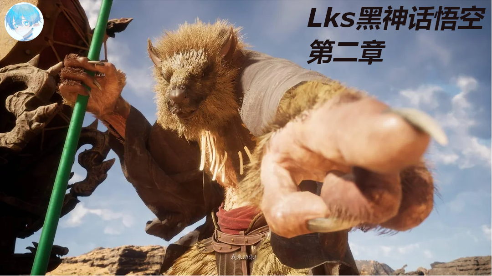

<!DOCTYPE html>
<html lang="zh-CN">
<head>
    <meta charset="UTF-8">
    <meta name="viewport" content="width=device-width, initial-scale=1.0">
    <title>假 YouTube 频道</title>
    
    
</head>
<body>

    

        

            

            

            

        

        
        

            <a href="#">主页</a>
            <a href="#">视频</a>
            <a href="#">播放列表</a>
            <a href="#">社区</a>
        

    

    
    

        <input type="text" placeholder="搜索...">
        <button onclick="searchChannel()">搜索</button>
    

    

        <h2>Lks在法国</h2>
    

    

        
        

            
Lks在法国

            
@nerdzun • 549万位订阅者 • 593 个视频

        

    

    

        欢迎来到我们的游戏频道！在这里，我们将分享各种有趣和搞笑的视频内容，包括挑战、游戏、旅行和更多。请与我一起享受欢乐时光！
    

    

        <button onclick="alert('跳转到主页')">主页</button>
        <button onclick="alert('跳转到视频')">视频</button>
        <button onclick="alert('跳转到播放列表')">播放列表</button>
        <button onclick="alert('跳转到社区')">社区</button>
    

    

        

            <a href="video1.html" target="_blank">
                
                
只狼初体验！

                
观看次数: 221万

                
时长: 01:27:54

            </a>
        

        

            <a href="video2.html" target="_blank">
                
                
视频标题 2

                
观看次数: 465万

                
时长: 01:24:15

            </a>
        

        

            <a href="video3.html" target="_blank">
                
                
视频标题 3

                
观看次数: 193万

                
时长: 01:16:14

            </a>
        

        

            <a href="video4.html" target="_blank">
                
                
我来助你！

                
观看次数: 241万

                
时长: 01:32:25

            </a>
        

   

            <a href="video4.html" target="_blank">
                
                
黑神话:悟空 启动！

                
观看次数: 347万

                
时长: 01:17:43

            </a>
        

 

   

            <a href="video4.html" target="_blank">
                
                
视频标题 6

                
观看次数: 4,567

                
时长: 5:00

            </a>
        

   

            <a href="video4.html" target="_blank">
                
                
视频标题 7

                
观看次数: 4,567

                
时长: 5:00

            </a>
        

    

</body>
</html>
